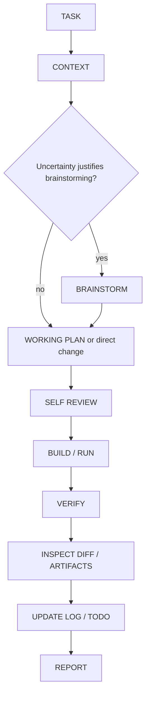

# Janus

**Modified from https://github.com/obra/superpowers**

> A lightweight, risk-adaptive workflow for AI-assisted development and research.

Janus is a personal skill system for two recurring jobs:

- small and medium-sized software projects;
- research code, machine-learning experiments, and experimental analysis.

Its rule is simple:

> Use the smallest process that still preserves understanding, verification, and recoverability.

## Why Janus exists

Team-scale autonomous-engineering workflows are useful for large, risky changes, but their ceremony is wasteful for every small edit. Janus keeps the useful constraints from Superpowers while making planning, testing, isolation, subagents, and review proportional to risk.

Janus is inspired by [obra/superpowers](https://github.com/obra/superpowers). It is an independent project with original wording and structure, not a fork or a mechanical copy.

## Three skills

| Skill | Responsibility |
| --- | --- |
| `brainstorming` | Frame genuine software, product, architecture, research, or experiment uncertainty. Skip it for obvious mechanical changes. |
| `developing` | Main workflow: context, proportionate Working Plan, self-review, build/run, verification, context recovery, diff inspection, project recording, and report. |
| `debugging` | Compressed evidence-first root-cause diagnosis for bugs, failed tests, unexpected results, and research anomalies. |

## Compatibility with specialized skills

Janus is designed to coexist with domain skills. If a skill is explicitly invoked or has already produced an authoritative upstream artifact, Janus consumes that output and continues from the appropriate stage instead of repeating its responsibility.

In particular, [Idea Refiner](https://github.com/BURIBURI-ZAEMON1/idea-refiner-skill) is an optional upstream companion for early product-idea refinement, related-work mapping, product identity, core mechanism design, and durable PRD production. When it is available, Janus consumes its current PRD or handoff when the task moves into engineering or experiment execution; it does not recreate the PRD. When it is absent, Janus `brainstorming` remains fully usable and handles the software or research framing itself. Idea Refiner is installed separately as `idea-refiner`, not vendored into Janus and not a runtime dependency.

## Core workflow



For a bug or anomalous result, use `debugging` before changing code or experiment conditions. For a research task, keep implementation evidence, experiment evidence, and hypothesis support separate.

## Risk-adaptive effort

Planning effort scales with:

```text
uncertainty x impact x reversibility
```

- **Trivial:** inspect, change, verify, inspect diff, record if meaningful, report.
- **Normal:** short Working Plan, self-review, implementation or run, verification, diff/artifact inspection, state update, report.
- **High risk:** brainstorm, detailed Working Plan, self-review, isolation if useful, stronger tests or review, verification, diff/artifact inspection, state update, report.

TDD, worktrees, subagents, and formal review are risk-based controls. They are not default ceremony. Verification is the invariant: do not claim success without fresh evidence.

## Working Plan

Janus uses one proportionate Working Plan instead of separate spec and implementation-plan documents. Focused normal work can use an in-thread or structured plan. Broad, long-running, high-risk, or multi-step work that may cross a context or session boundary should persist the plan in the project's existing plan location, or `docs/plans/YYYY-MM-DD-<task>.md` when none exists. A plan may contain:

```markdown
# Working Plan

## Goal
## Context / Constraints
## Design
## Scope
## Changes
## Verification
```

Omit sections that do not help. A trivial change does not need a plan solely for ceremony; an architectural change can include alternatives, compatibility, migration, rollback, and risks.

### Context recovery

A fresh execution conversation does not automatically scan for or read plans. Read a known plan when the user points to it, asks to execute or continue plan-backed work, or retained task context already identifies it as the source of truth. Within such a task, after conversation compaction or an explicit resume, first check whether the goal, next step, completed work, and constraints remain clear. If they do, continue without reloading the file. If anything is unclear or contradictory, re-read the known plan, inspect `git status` and the relevant diff or artifacts, consult `LOG.md` / `TODO.md`, reconcile actual progress, and update the structured task plan before continuing. Do not guess among multiple possible plans; compaction is a reason to check clarity, not an unconditional reload trigger.

## Recoverable project state

After substantive work:

```text
VERIFY -> INSPECT DIFF -> UPDATE LOG -> SYNC TODO -> REPORT
```

`LOG.md` is append-oriented history for decisions, results, evidence, failed approaches, discoveries, and constraints useful to future sessions. `TODO.md` is the current state: completed work, active work, invalidated ideas, priorities, and the next useful action.

> Code tells what the project is. LOG tells how it got here. TODO tells where it goes next.

## Installation

The three directories under `skills/` are ordinary Codex skills. Copy them into the configured skills directory after backing up any same-named skills:

```powershell
$janus = 'D:\Github_Storage\Janus\skills'
$codexSkills = 'C:\Users\Soyo\.codex\skills'
Copy-Item -LiteralPath "$janus\brainstorming" -Destination $codexSkills -Recurse
Copy-Item -LiteralPath "$janus\developing" -Destination $codexSkills -Recurse
Copy-Item -LiteralPath "$janus\debugging" -Destination $codexSkills -Recurse
```

`brainstorming` replaces the heavier default with the Janus version. `developing` is the main entry for implementation and research work; `debugging` is used only when diagnosis is needed. Janus does not modify the original Superpowers files.

Idea Refiner is optional and can be installed separately from its upstream repository if its product-definition workflow is useful. In this Codex environment, the installer command is:

```powershell
python C:\Users\Soyo\.codex\skills\.system\skill-installer\scripts\install-skill-from-github.py --repo BURIBURI-ZAEMON1/idea-refiner-skill --path skills/idea-refiner --dest C:\Users\Soyo\.codex\skills
```

Use Idea Refiner when the product or creative idea itself is still being defined. Use Janus after that upstream artifact is stable enough for implementation or experiment planning. If Idea Refiner is not installed, use Janus `brainstorming` directly; no Janus feature is disabled.

## Software example

For a small README command correction, skip brainstorming: inspect the file, make the narrow edit, reread the result, inspect the diff, and record only if the decision matters later.

For a new retry policy, write a short Working Plan, choose a regression test because the behavior is reusable, implement the smallest change, run the relevant tests, inspect the diff, update state, and explain the tradeoff.

## Research example

For an unexpected model result, use the research mode of `brainstorming` or `debugging`: state the question and hypothesis, check assumptions and baseline, identify observable variables and metrics, run the smallest discriminating experiment, and report separately whether the code worked, the experiment ran, and the hypothesis was supported.

## License and attribution

Janus is released under the MIT License. It is inspired by obra/superpowers, but this repository does not copy its skill text. Idea Refiner remains an external dependency and is not vendored into this repository.
